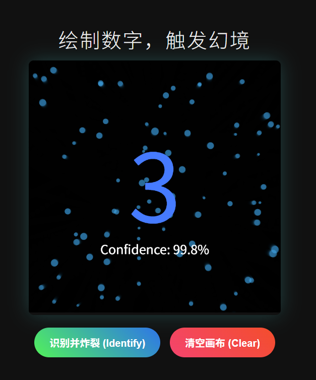

# Digit Soul: 手写数字的粒子幻境 (AI + Generative Art)

> "当卷积神经网络遇上生成式艺术，冰冷的数字便有了灵魂。"

## 🎨 项目简介 (Introduction)

这是一个端到端的分布式手写数字识别系统。不同于传统的 MNIST 识别 Demo，本项目将 **深度学习 (Deep Learning)** 与 **创意编程 (Creative Coding)** 相结合。

当用户手写下一个数字时，后端的 CNN 模型不仅会进行高精度识别（准确率 >98%），还会计算出 AI 的“置信度”。前端会根据这些数据，通过 **p5.js 粒子系统** 将笔迹炸裂成绚丽的动态视觉效果——数字不再是静态的结果，而是一场数据的烟花。

## ✨ 核心特性 (Features)

* **🧠 工业级精度：** 基于 PyTorch 构建的 CNN（卷积神经网络），在 MNIST 测试集上达到 **97.8%** 以上准确率。
* **👁️ 智能视觉预处理：** 实现了自动包围盒裁剪与重心对齐算法，无论用户画在哪、画多小，都能精准识别。
* **🎆 生成式艺术前端：** 基于 p5.js 的粒子爆炸系统。粒子颜色、速度、寿命均由 AI 的推理置信度 (Confidence) 动态驱动。
* **⚡ 分布式/前后端分离：** * **Backend:** Python Flask + PyTorch (运行在高性能算力节点)
    * **Frontend:** HTML5 + p5.js (可运行在任意边缘设备/手机/低配电脑)

## 🛠️ 技术栈 (Tech Stack)

* **模型训练:** Python, PyTorch, torchvision
* **后端服务:** Flask, Flask-CORS, Pillow
* **前端交互:** p5.js, Vanilla JS, Fetch API
* **工具:** Ngrok (用于公网穿透演示)

## 🚀 快速开始 (Quick Start)

### 1. 安装依赖
确保已安装 Python 3.8+，然后运行：
```bash
pip install torch torchvision flask flask-cors pillow
2. 训练模型 (可选)
仓库中已包含预训练好的 mnist_cnn.pth。如果你想重新训练：
python train.py
3.启动后端服务
Bash

python app.py
服务默认运行在 http://0.0.0.0:5000

文件结构
├── train.py          # 模型训练脚本 (CNN架构定义)
├── app.py            # Flask 后端服务 (推理 + 图像预处理)
├── index.html        # 前端交互界面 (p5.js 粒子特效)
├── mnist_cnn.pth     # 预训练好的模型权重
└── README.md         # 项目文档
